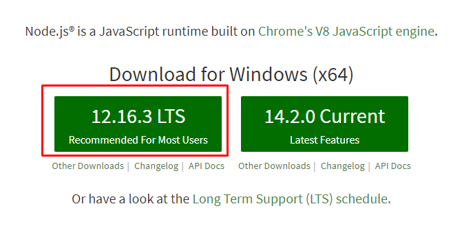
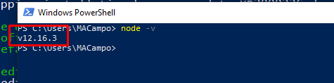
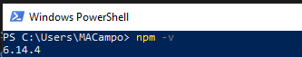
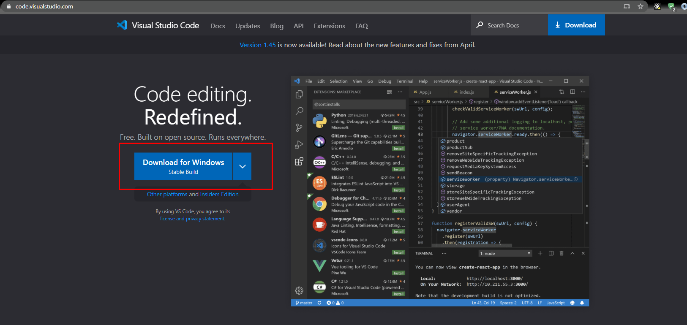
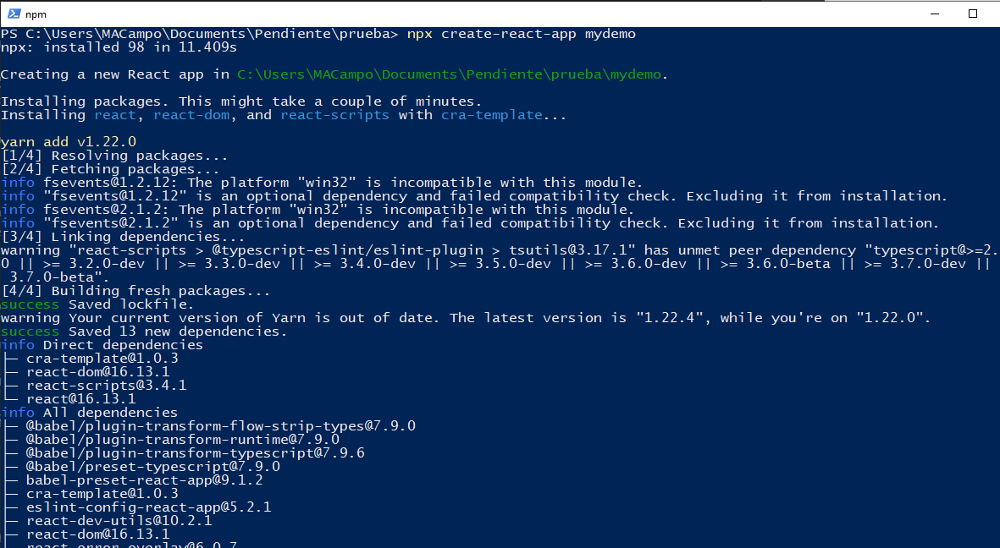
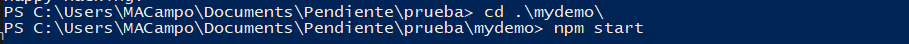
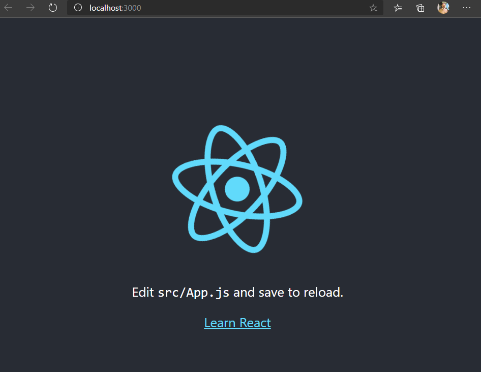

# kabel-training-react-basics

Curso de iniciación de REACT para KABEL

## 0. Requisitos iniciales

Este curso, como ya supones, es enteramente FRONT-END, por lo que vamos a necesitar las siguientes herramientas/frameworks:

### 0.1. Node

Dirigete a la siguiente url <https://nodejs.org> y descárgate la verisón recomended


Para comprobar que se ha instado puede ejecutar lo siguiente

```powershell
node -v
```

Debe saliir la misma versión que acabas de instalarte



### 0.2. npm

Con la instalación de Node debería ser suficiente, pero para comprobar que todo está listo ejecuta el siguiente comando

```powershell
npm -v
```



### 0.3 Visual Studio Code

Se puede utilizar diferentes entornos de desarrollo, pero en este caso y para este curso utilizaremos Visual Studio Code, que se puede descargar de <https://code.visualstudio.com>


### 0.4 Prueba final

Vamos a crear un prpyecto de ejemplo de tal manera que comprobemos que todo está bien instalado.

Escoge una carpeta y ejecuta lo siguiente sobre la misma

```shell
npx create-react-app mydemo
```



Una vez haya instalado todas las dependencias del proyecto nos metemos en la carpeta recien creada "mydemo"
Dentro de esa misma carpeta ejecutamos los siguiente

```shell
npm start
```



Se nos abrirá de forma automática una ventana en nuestro navegador por defecto http://localhost:3000/ (en caso contrario podemos abrirlo nosotros)



YA ESTAMOS PREPARADOS PARA EMPEZAR EL CURSO

## 1. Qué es REACT

React es una librería Javascript de interfaz de usuario, desarrollada por Facebook. Esta librería se basa en el paradigma de programación orientada a componentes. Esta librería nos permitirá realizar componentes reutilizables que se pueden combinar para crear componentes de un nivel superior, hasta conformar una web. Lo que permite desarrollar interfaces de usuario de una forma más escalable que simplemente con HTML, CSS y Javascript cada uno por su lado.

React se ha hecho inmensamente popular debido a: facilidad para el desarrollo,  rendimiento y flexibilidad. Además, ha surgido todo un ecosistema de librerías que enriquecen el entorno de React, como por ejemplo Redux, lo que hacen la elección de React una gran alternativa para el desarrollo de frontales web modernos.

### 1.1 Arquitectura basada en componentes

React se basa en el paradigma de programación orientada a componentes, ¿qué es esto? Este paradigma se basa en la modularización, buscando piezas de software reutilizables y que permitan la composición. Es decir, se busca dividir la interfaz de usuario en pequeñas "piezas" denominadas componentes, que combinadas crearán componentes mayores hasta conseguir la interfaz deseada.


Todo ello hace que deba afrontarse el desarrollo de la interfaz con un enfoque de abajo hacia arriba. Comenzando por la identificación de los componentes más pequeños y acabando a nivel de página o pantalla. Con ello se obtienen además las siguientes ventajas:

* **Desarrollo más específico**: comenzar con componentes más pequeños permite centrarse en la funcionalidad específica que debe realizar.
* **Feedback más efectivo**: es más sencillo identificar los cambios y permite realizar una comunicación más eficiente.
* **Librerías de componentes**: la reutilización de componentes facilita la creación de librerías de componentes.
* **Trabajo en paralelo**: varios miembros del equipo pueden trabajar sobre la misma página de forma más eficiente, puesto que cada miembro puede centrarse en unos componentes sin pisar los componentes de otro.
* **Tests visuales**: se pueden crear exploradores de componentes que permitan ver cada componente y con los que se pueden conseguir automatizar test visuales del estilo de los componentes.

### 1.2 Crear una nueva aplicación

Para facilitarnos la tarea de comenzar una aplicación desde cero, Facebook nos proporciona un boilerplate con todo lo necesario para trabajar con React, permitiendonos incluso configurar aspectos como el uso de typescript en la aplicación.

Podemos ejecutar la creación de la aplicación de la siguiente forma:

```shell
npx create-react-app mydemo
```

o

```shell
npm init react-app my-app
```

Incluso si lo deseamos, con yarn:

```shell
yarn create react-app my-app
```

#### 1.2.1 Partes de la aplicación

Si el comando se ha ejecutado correctamente, en el directorio sobre el que se lanza el comando, se creará un directorio my-app con la siguiente estructura:

```bash
my-app
├── README.md
├── node_modules
├── package.json
├── .gitignore
├── public
│   ├── favicon.ico
│   ├── index.html
│   ├── logo192.png
│   ├── logo512.png
│   ├── manifest.json
│   └── robots.txt
└── src
    ├── App.css
    ├── App.js
    ├── App.test.js
    ├── index.css
    ├── index.js
    ├── logo.svg
    └── serviceWorker.js
```

Las diferentes partes que podemos encontrar son:

* readme.md: Archivo markdown con la descripción de los comandos disponibles.
* node_modules: Carpeta en la que se instalan todos los paquetes de los que depende la solución.
* package.json: Archivo de configuración de npm, en él se encuentra listadas las depencias y definidos los scripts de npm disponibles.
* public: en esta carpeta encontraremos ficheros que se publicaran con la aplicación. Por ejemplo, si la aplicación corre en localhost:3000, podremos encontrar <http://localhost:3000/robots.txt> el fichero que se encuentra en la carpeta public.
* src: este será el directorio en el que nos encontremos el código de la aplicación. Aunque en este boilerplate está todo en la raíz de src, lo más común es tener diferentes directorios para organizarlo, por ejemplo: directorio styes, directorio components.

### 1.3 Componentes

Los componentes, como ya se ha visto, son la piedra angular en torno a la que gira todo. No hay React sin componentes.

#### 1.3.1 Qué es un componente

Formalmente, ya se ha dado una definición de componente, son piezas de la interfaz de usuario con las características de ser independientes, reutilizables, combinables y aisladas. Sin embargo, qué es un componente cuando hablamos de React.

React ha simplificado mucho los componentes, estos pasan a ser funciones que aceptan unas entradas (denominadas props) y que devuelven unos elementos que describen qué es lo que debe mostrarse en pantalla.

Veamos un componente React muy sencillo:

```jsx
function Welcome() {
  return <h1>Hello, World!</h1>;
}
```

Como vemos, tenemos una función "Welcome", es decir, el componente Welcome, el cuál indica que debe mostrarse en pantalla una etiqueta H1 con el texto "Hello, World!".

Podemos complicar este componente un poco más para que cambie en base a una entrada en la función, sin entrar en detalles del paso de parámetros que se abordan en el punto 2.

```jsx
function Welcome(props) {
  return <h1>Hello, {props.name}!</h1>;
}
```

Este componente estará renderizando una etiqueta H1 con un mensaje que variará en función de la entrada.

Los componentes, además de etiquetas y elementos de HTML, pueden representar otros componentes de React:

```jsx
function WelcomeFernando() {
  return <Welcome name="Fernando" />;
}
```

o

```jsx
const WelcomeFernando = <Welcome name="Fernando" />;
```

El componente WelcomeFernando está mostrando el componente Welcome de forma concreta, pasándole como name el string "Fernando".

#### 1.3.2 css + className

#### 1.3.3 style

#### 1.3.4 imágenes

### 1.4 Código en react

#### 1.4.1 if

#### 1.4.2 for

### 1.5 Ejercicio1

## 2. Repetción de componentes

### 2.1 KEY

### 2.2 Paso de parámetros

#### 2.2.1 Parámetros del DOM

#### 2.2.2 Parámetros de componentes CUSTOM

#### 2.2.3 Componentes anidados (children)

#### 2.2.4 Parámetros opcionales y valor por defecto

### 2.3 Eventos

### 2.4 Ejercicio 2

## 3. State vs Props

### 3.1 El peligro de usar el state

### 3.2 Ejercicio 3

## 4. Routing

### 4.1 Montar el router

### 4.2 Cómo navegar

### 4.3 Paso de parámetros

### 4.4 RouterComponentProps

## 5. Ajax en react

## 6. Formularios en react

### 6.1 one-way-binding

### 6.2 Ejercicio 4

## 7. Propuesta final

## Refs

* TypeScript
* <https://es.reactjs.org/docs/thinking-in-react.html>
* Cómo meter librerías de terceros
