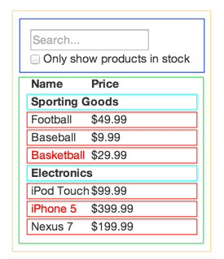

# kabel-training-react-basics

Curso de iniciación de REACT para KABEL

## 0. Requisitos iniciales

Este curso, como ya supones, es enteramente FRONT-END, por lo que vamos a necesitar las siguientes herramientas/frameworks:

### 0.1. Node

Dirigete a la siguiente url <https://nodejs.org> y descárgate la verisón recomended


Para comprobar que se ha instado puede ejecutar lo siguiente

```powershell
node -v
```

Debe saliir la misma versión que acabas de instalarte


### 0.2. npm

Con la instalación de Node debería ser suficiente, pero para comprobar que todo está listo ejecuta el siguiente comando

```powershell
npm -v
```


### 0.3 Visual Studio Code

Se puede utilizar diferentes entornos de desarrollo, pero en este caso y para este curso utilizaremos Visual Studio Code, que se puede descargar de <https://code.visualstudio.com>


## 1. Qué es REACT

React es una librería Javascript de interfaz de usuario, desarrollada por Facebook. Esta librería se basa en el paradigma de programación orientada a componentes. Esta librería nos permitirá realizar componentes reutilizables que se pueden combinar para crear componentes de un nivel superior, hasta conformar una web. Lo que permite desarrollar interfaces de usuario de una forma más escalable que simplemente con HTML, CSS y Javascript cada uno por su lado.

React se ha hecho inmensamente popular debido a: facilidad para el desarrollo,  rendimiento y flexibilidad. Además, ha surgido todo un ecosistema de librerías que enriquecen el entorno de React, como por ejemplo Redux, lo que hacen la elección de React una gran alternativa para el desarrollo de frontales web modernos.

### 1.1 Arquitectura basada en componentes

React se basa en el paradigma de programación orientada a componentes, ¿qué es esto? Este paradigma se basa en la modularización, buscando piezas de software reutilizables y que permitan la composición. Es decir, se busca dividir la interfaz de usuario en pequeñas "piezas" denominadas componentes, que combinadas crearán componentes mayores hasta conseguir la interfaz deseada.



Todo ello hace que deba afrontarse el desarrollo de la interfaz con un enfoque de abajo hacia arriba. Comenzando por la identificación de los componentes más pequeños y acabando a nivel de página o pantalla. Con ello se obtienen además las siguientes ventajas:

* **Desarrollo más específico**: comenzar con componentes más pequeños permite centrarse en la funcionalidad específica que debe realizar.
* **Feedback más efectivo**: es más sencillo identificar los cambios y permite realizar una comunicación más eficiente.
* **Librerías de componentes**: la reutilización de componentes facilita la creación de librerías de componentes.
* **Trabajo en paralelo**: varios miembros del equipo pueden trabajar sobre la misma página de forma más eficiente, puesto que cada miembro puede centrarse en unos componentes sin pisar los componentes de otro.
* **Tests visuales**: se pueden crear exploradores de componentes que permitan ver cada componente y con los que se pueden conseguir automatizar test visuales del estilo de los componentes.

### 1.2 Crear una nueva aplicación

#### 1.2.1 Partes de la aplicación

### 1.3 Componentes

#### 1.3.1 Qué es un componente

#### 1.3.2 css + className

#### 1.3.3 style

#### 1.3.4 imágenes

### 1.4 Código en react

#### 1.4.1 if

#### 1.4.2 for

### 1.5 Ejercicio1

## 2. Repetción de componentes

### 2.1 KEY

### 2.2 Paso de parámetros

#### 2.2.1 Parámetros del DOM

#### 2.2.2 Parámetros de componentes CUSTOM

#### 2.2.3 Componentes anidados (children)

#### 2.2.4 Parámetros opcionales y valor por defecto

### 2.3 Eventos

### 2.4 Ejercicio 2

## 3. State vs Props

### 3.1 El peligro de usar el state

### 3.2 Ejercicio 3

## 4. Routing

### 4.1 Montar el router

### 4.2 Cómo navegar

### 4.3 Paso de parámetros

### 4.4 RouterComponentProps

## 5. Ajax en react

## 6. Formularios en react

### 6.1 one-way-binding

### 6.2 Ejercicio 4

## 7. Propuesta final

## Refs

* TypeScript
* <https://es.reactjs.org/docs/thinking-in-react.html>
* Cómo meter librerías de terceros
